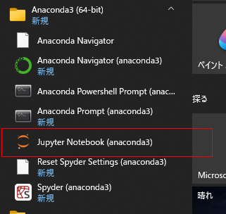

# Pythonで理解する微分積分の基礎
本書のサポートページです。

# Pythonの環境構築と使い方（Windows10）

- [環境構築](##環境構築)
    - [Anacondaのインストール](###Anacondaのインストール)
    - [ライブラリのversion](###ライブラリのversion)
- [Jupyter Notebookの起動](##JupyterNotebookの起動)

## 環境構築

### Anacondaのインストール

個人利用の場合は、AnacondaからPythonをインストールを推奨します。
Anacondaには、科学技術計算用ライブラリがパッケージされており、追加ライブラリのインストールの必要がありません。

https://www.anaconda.com/products/individual
からPython3.9 versionをダウンロード、インストールして下さい。

### ライブラリのversion

本書のコードは次のバージョンで実行できることを確認しています。

|パッケージ名|バージョン|
|:-:|:-:|
|python|3.9.7|
|jupyter-notebook|6.4.5|
|sympy|1.9|
|numpy|1.20.3|
|matplotlib|3.4.3|
|scipy|1.7.1|

## JupyterNotebookの起動

スタートメニューからJupyter Notebookを起動します。

デフォルトのブラウザで起動すれば成功です。
